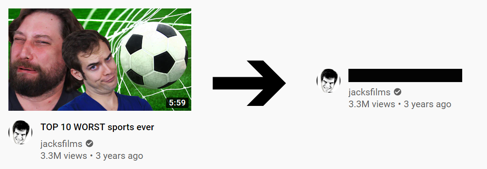

# Hide YouTube recommendations

This userscript reduces your distraction on YouTube by removing thumbnails and censoring video titles of the recommended videos on the main page and in the recommendation sidebar. Video titles can still be viewed by highlighting the corresponding black boxes (e.g. by pressing Ctrl+A) but they no longer steal your attention.

To install this userscript, make sure you have Tampermonkey installed ([Chrome link](https://chrome.google.com/webstore/detail/tampermonkey/dhdgffkkebhmkfjojejmpbldmpobfkfo), [Firefox link](https://addons.mozilla.org/en-US/firefox/addon/tampermonkey/)) and [click here](https://raw.githubusercontent.com/artli/hide-youtube-recommendations/latestRelease/hide_youtube_recommendations.user.js).
